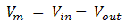
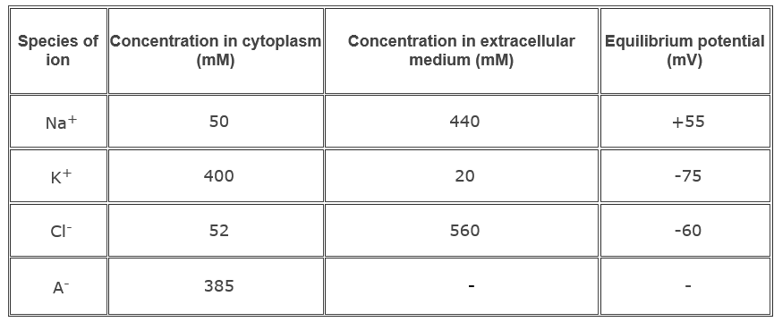
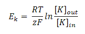
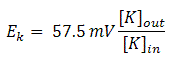
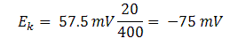
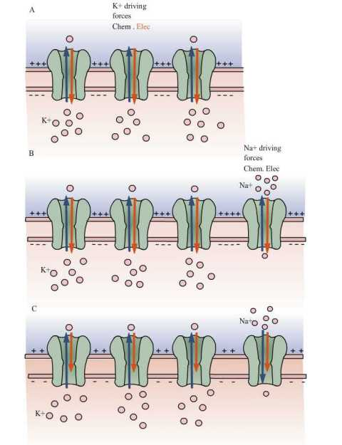
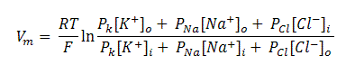

In this exercise, we considered the basic principle behind resting potential, i.e., how resting ion channels maintain resting potential and the mathematical models used for studying this mechanism.

Every electrically excitable cell (e.g., nerve cells ) have the property of separation of charges  across the lipid membrane as a result of a small concentrations of positive and negative ions that are spread over the inner and outer membrane of the cell. This charge separation results in keeping the inside of the cell with a more negative charge and outside of the cell with a more positive charge. Since, lipid bilayer is impermeable to ions, it blocks the diffusion of ions into and out of the membrane. The charge separation across the membrane gives rise to the difference in voltage or electrical potential across the membrane and is called as membrane potential, denoted by Vm.
 

 
&nbsp;

 
 Eq(1)

 

Where Vin is the potential inside the cell and Vout is the potential outside the cell, i.e. when the cell is at rest, called resting potential. By convention, taking Vout =0, then Vm = Vin the potential ranges from -60 mV to -70 mV.

 
Electrical signal propagation in neuron involves the movement of charges across the membrane, which causes alterations in the flow of electrical current resulting from the opening and closing of ion channels. The flow of ions, both cations (positively charged) and anions (negatively charged) across the membrane causes the movement of electric charges. The direction of the current flow is dependent on the direction of net movement of positive ions and anions in opposite direction. The net movement of cations or anions into or out of the cell results in alteration of membrane potential (depolarization or hyperpolarization). Thus alteration in charge separation leading to a less negative membrane potential and is called as depolarization and to a more negative membrane potential called as hyperpolarization. These changes in membrane potential (as a result of non-voltage-gated ion channels) are called electrotonic potential / passive response of a membrane. Hyperpolarization responses are always passive. When, depolarization reaches/attains a critical value (i.e. ranges from -50 to -40 mV) called as the threshold, the cell responds actively with the opening of voltage-gated ion channels, thus producing an action potential all-or-none response.

 
**The resting membrane potential is determined by resting ion channels**

 

Most abundant ions found on either side of the cell membrane are Na+, K+and Cl-.  Na+ and Cl- are more concentrated outside the cell and K+ and organic anions (A-) are more concentrated inside the cell. Table 1.1 shows the distribution of ions inside and outside the membrane of well-studied nerve cell axons of the squid. The salt concentration inside the squid nerve cell is similar to that of salt water. The absolute values of the ionic concentrations for vertebrate nerve cells are two to three folds lower than those for the squid giant axon, but the ratio of the external ion concentration to internal ion concentration is about the same.

 

Table 1.1 Distribution of the major ions of the giant axon of the squid at rest.

 
&nbsp;

 
 

 
Ion channels in neuronal membranes are generally divided into two, resting and voltage-gated ion channels. Resting membranes/passive channels are always stay open, but the regulation of voltage-gated channels are dependent upon the voltage fluctuations. Overall selectivity of individual ion species of a membrane is determined by the proportions of the various types of ion channels in the cell that are open. In case of the glial cells, it has a resting potential of about -75 mV. Most of the resting ion channels in the membrane are only permeable to K+ ions. As a result, glial cells have a high concentration of K+ and organic anions on the inside and a high concentration of Na+  and Cl- on the outside.

These ionic gradients are responsible for generation of the membrane potential in nerve cells. Since, high concentrations of K+ ions are present inside the cell and the neuronal membrane is selectively permeable to K+,  it diffuses from inside to outside of the cell with the help of the chemical concentration gradient (see Fig 1A). This selective permeability helps in maintaining  the outside of the membrane  with a more positive charge (due to the slight excess of K+) and inside of the cell with a more negative charge (because of the deficit of K+ and slight excess of anions). Since, opposite charges attract each other, the excess positive (outside) and negative (inside) charges arrange on either surface of the membrane.

As a result of the continuous flow of K+ ions, more charges will be separated and hence greater will be the potential difference. Since K+ is positively charged, the potential difference starts to oppose the further efflux of K+ ions. Mainly two forces control the movement of K+ ions in and out of the cell: 1) chemical driving force that depends on the concentration gradient (driving K+ outside the cell) and 2) electrical driving force that depends on electrical potential difference across the membrane (driving K+ inside the cell). There will be a point at which equilibrium is established between these two forces. The potential at this point is called as equilibrium potential of potassium Ek. In cells that are permeable only to K+ ions, the Resting potential is determined by Ek .

Equilibrium potential for a given ion can be calculated using Nernst equation. This classical thermodynamic principle was derived by the German physical chemist Walter Nernst:

Equilibrium potential for K+ ions is given by:

 
&nbsp;

Eq(2)

where R is the gas constant, T is the temperature (in degrees Kelvin), z is the valence of the ion, F is the Faraday constant and [K]o and [K]i are the concentrations of K+ ions outside and inside the cell.

At 25°C (room temperature), RT/F is 25 mV.
So, for converting from natural logarithms to base 10 logarithms, it is multiplied by 2.3, so the Nernst equation can also be written as:

 
&nbsp;

 

Eq(3)

 Equilibrium potential of K+ ions concentrations inside and outside the squid axon is given by:

 
 
&nbsp;

Eq(4)

 

Nernst equation can be used to find the equilibrium potential of any species of ions that are present on both sides of the membrane. The resting membrane potential of a nerve cell is maintained by the continuous diffusion and electrostatic movement of  Na+  and Cl- ions in addition to K+ ions across the membrane, unlike glial cells which are permeable to only K+ ions.

Now consider what will happen if resting Na+ channels are also present in the membrane, or in case two or more ions are permeable through the membrane or making the membrane permeable to Na+ ions. Mainly two forces act on Na+  ions to drive into the cell. Since more Na+ ions are concentrated outside the cell than inside, 1) concentration gradient ( Na+ ions drive to move into the cell), 2) Na+ ions also drive into the cell because of negative electrical potential difference across the membrane. The influx of positive charges (i.e. Na+) depolarizes the cell slightly from K+ equilibrium potential (-75 mV).

The membrane begins to depolarize from the value of K+ equilibrium potential as an effect of Na+ ions rushing into the cell. The concentration of K+ ions equilibrium gets disturbed, as a result of which there will be a negative electrical force driving K+ into the cell for counteracting the Na+ influx. The more the membrane is depolarized or moves away from the equilibrium potential, the greater the amount of K+ ions are driven out of the cell and thus greater will be the K+ efflux.

Finally the membrane potential reaches an equilibrium, when the outward movement of K+ ions equals the inward movement of Na+ ions. This equilibrium point of membrane potential is usually -60 mV which is far from the Na+ equilibrium potential (+55 mV) and slightly more positive than the K+ ions equilibrium potential (-75 mV).

Charge separation across the membrane keeps the membrane potential constant, when the cell is at rest. Until the charge separation gets balanced, the membrane potential would vary continuously (Fig 1B). These continuous ion leaks bring Na+ and K+ gradients down; thus reducing the resting membrane potential (Fig 1C).

 

 
&nbsp;

 
Figure 1: The resting potential of a cell is determined by relative distribution of different ions with the value of their equilibrium potentials.

A. In a resting cell in which only K+ passive channels are present, when K+ ions are in equilibrium , then Vm = EK.

B. Consider that Na+ channels along with K+ ion channels depolarize the membrane, because Na+ ions  diffuse into the cell and those influx resulted in to move membrane potential more positive.

C. Membrane potential get settled at new resting potential called as steady-state condition, in which neither Na+ nor K+ is in equilibrium but the net flux of charge is null.

This dissipation of concentration gradient is prevented by Na+ , K+ pump. The steady membrane potential, when the cell is at rest is maintained by this pump. This pump moves three Na+ inside and two K+ ions out against their concentration gradient by consumption of one ATP.

The contribution of chloride ions (Cl-) to the resting potential is ignored even though many nerve cells have resting Cl- channels. Nerve cells do not have any mechanism for active transport of Cl- against concentration gradient. Those cell’s resting potential is determined by K+ and Na+  fluxes because the intracellular concentrations of K+ and Na+  are maintained by the Na+-K+ pump (an active transport). Concentration of Cl- inside the cell is only affected by electrical potential and concentration gradient. Cl- ions reach equilibrium so that ECl is equal to the resting potential and there is no net Cl- flux at rest.
 

 

 
### Determination of resting membrane potential as contribution of different ions using Goldman Equation

Nernst equation could only calculate the equilibrium potential of one ion at a time, but Na+  and only ions together will determine the potential across the membrane. Vm (the potential of membrane at rest) lies between ENa and Ek. The determination of membrane potential not only depends upon the concentration of ions, inside and outside the membrane but also on the movement of ions across the membrane. Net flow of ions across the membrane not only depends on one particular ion but also on the concentration of permeability of other ions. In that case, the membrane potential which depends on concentration and ionic permeability is given by Goldman Equation:
 

 
&nbsp;

 Eq(5)

 

Where Vm is the membrane potential (in volts, equivalent to joules / coulomb) , Px  is the permeability of a ion ‘x’ (in meters / second), [x]o is the extracellular concentration of that ion (in moles / cubic meter) , [x]i = the intracellular concentration of that ion (in moles / cubic meter), R is the ideal gas constant (joules per Kelvin / mole), T is the temperature in kelvins and F the Faraday's constant (coulombs / mole).

The GHK equation states that, the permeability of a particular ion species depends on its concentration, greater the concentration greater will be its permeability. In 1940’s Alan Hodgkin and Bernard Katz studied the membrane potential using Goldman’s equation. They had measured the variation in membrane potential, while changing the extracellular concentration of Na+, Cl- and K+. They also found that extracellular concentrations of K+ ions has strong effect on resting potential,  Cl- has a moderate effect, and Na+  has little effect.

 

The resting membrane potential in nerve cells is determined primarily by resting channels present in the membrane. At rest, the membrane potential approaches to Nernst potential for K+, the ion to which the membrane is most permeable. The membrane is also permeable to little Na, so an influx of Na+ drives the membrane potential slightly positive to the K+ Nernst potential. At this point K+ ions are no longer in equilibrium because of electrical and chemical driving forces, so K+ diffuse out of the cells. These two passive fluxes are counter-balanced by active fluxes driven by the Na+-K+ pump. The cell spends energy to keep membrane potential at rest.
