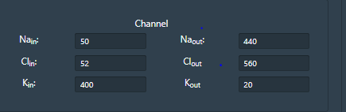
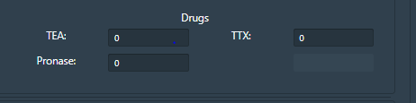
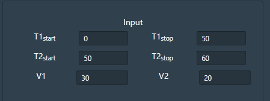
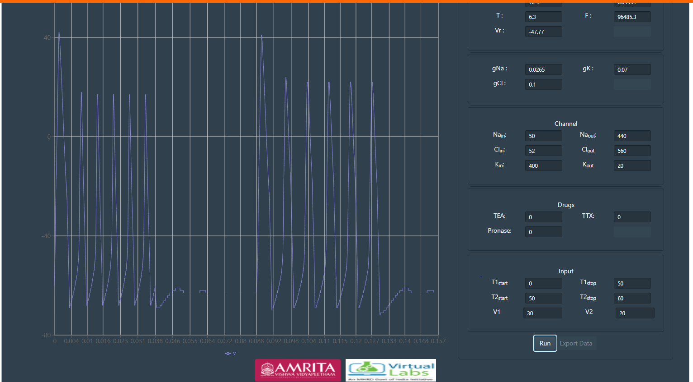

### Procedure

. Simulator uses Hodgkin and Huxley equation and provides full accesses to HH parameters, membrane parameters, various ionic concentrations, pharmacological effects, stimulus parameters and Vclamp protocol.

. By default the simulator window will be in current clamp mode, for every reset the mode will reset to current clamp.

 &nbsp;

### Understanding Simulator Parameters

Cm  = Membrane Capacitance (nF)

Rm  = Membrane resistance (MΩ)

Vr  = Resting Voltage (mV)

T = Temperature (0C)	

F= Frequency (Hz)

 &nbsp;

. Channel windows indicates parameters for each of the active or passive ion channel types. Passive channels conductance can be varied in the channel window. Voltage gated channels parameters can be accessed by clicking on channel details.

gNa = Conductance of Sodium ions

gK= Conductance of Potassium ions

gCl= Conductance of Chloride ions

 &nbsp;

. Membrane window provides accesses to internal and external ionic concentration (Sodium, chloride and potassium) and membrane properties.

. Drug window helps to study the pharmacological effect in neuronal membrane by the application of three drugs TTX (Inhibit Na current), TEA (Inhibit K current), Pronase (eliminate Na+ inactivation).Drugs can be applied at any point of time. 

 &nbsp;

. Input parameters provide stimulus to inject depolarization or hyperpolarization current to neuronal membrane. Simulation parameters can be modified in Membrane window, Channels window, Drugs window, Stimuli windows. 

 &nbsp;

. Click on run  button to execute simulator. 

 &nbsp;

. Plot indicates the membrane potential starts at different time intervals. 

. With varying input parameters user can  set the hyper-polarization state using the input parameters and can set stimuli section. After prolonged hyperpolarization, the sudden release from hyperpolarization leads to the generation of action potential which is termed as Anodal excitation or Rebound Spike. 

. The user can choose either current clamp or voltage clamp and  change the concentration of different ions like sodium, potassium and chlorine inside and outside, test with various passive parametric values for different voltage-gated channels and observe the behavior in the presence of pharmacological blockers such as tetrodotoxin(TTX) and tetraethylammonium(TEA). 

. Detailed explanation of drug channels are explained in  Experiment Effects of pharmacological blockers on action.
